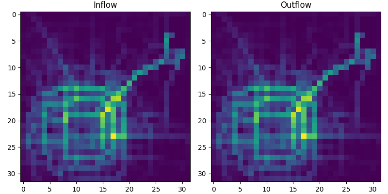

# demand-pytorch 

## Results



We report MAE in Beijing taxi flow prediction dataset for each prediction steps.
| Model | bj-flow (15 min) | bj-flow  (30 min) | bj-flow (1 hour) |
|-------|--|--|--|
| ConvLSTM | | | | |
| STResNet | | | | |
| DeepSTN  | | | | |

RMSE
| Model | bj-flow (15 min) | bj-flow  (30 min) | bj-flow (1 hour) |
|-------|--|--|--|
| ConvLSTM | | 17.38 | | |
| STResNet | | | | |
| DeepSTN  | | | | |

## Getting Started

### Data
- Beijing Taxi: download bj-flow.pickle from [Google Drive]()
- NYC Bike:

### Environment
``` 
conda create -n $ENV_NAME$ python=3.7
conda activate $ENV_NAME$

# CUDA 11.3
pip install torch==1.11.0+cu113 --extra-index-url https://download.pytorch.org/whl/cu113 
# Or, CUDA 10.2 
pip install torch==1.11.0+cu102 --extra-index-url https://download.pytorch.org/whl/cu102 
pip install -r requirements.txt
```

### Train
If config file not specified, load $MODEL_NAME$_config.py by default. 
```
python train.py --model $MODEL_NAME$ --ddir $PATH_TO_DATASET$ --dname $DATASET_NAME$
```

